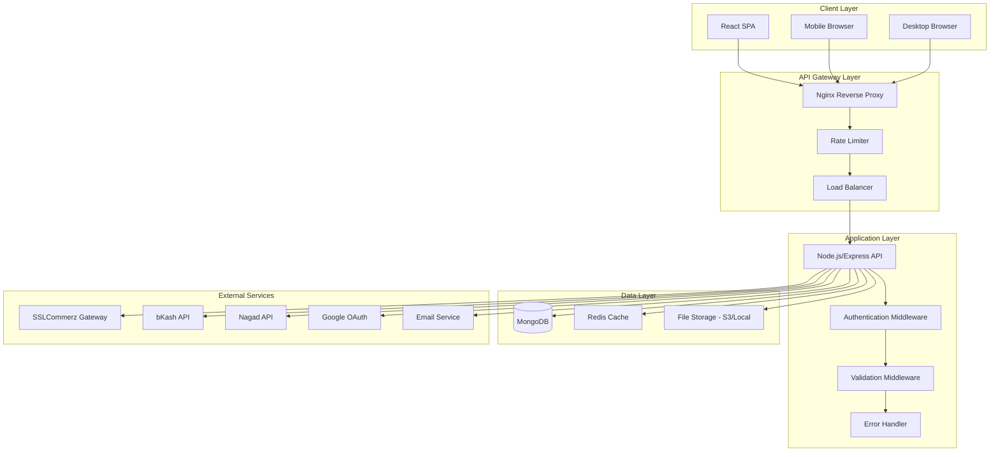
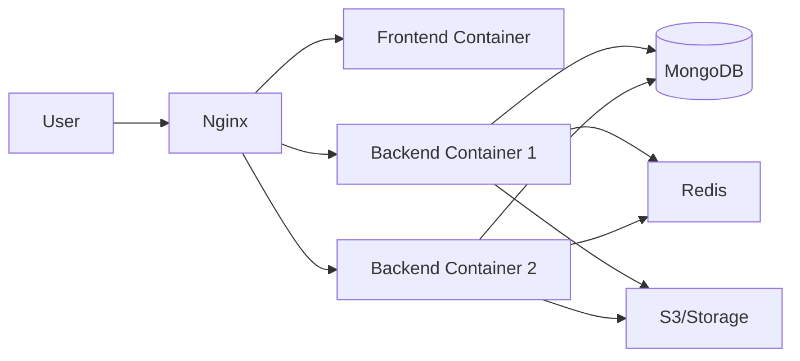

# Design Document: onulota eCommerce Platform

## Overview

The onulota eCommerce Platform is a production-ready, scalable web application designed for the Bangladesh market. The system follows a modern three-tier architecture with a React frontend, Node.js/Express backend, and MongoDB database. The platform prioritizes mobile-first design, low bandwidth optimization, local payment gateway integration (bKash, Nagad, Cash on Delivery), and security best practices.

### Key Design Principles

1. **Mobile-First**: Optimized for mobile devices with responsive design and bandwidth-conscious asset delivery
2. **Security by Default**: JWT authentication, bcrypt password hashing, input validation, rate limiting, and security headers
3. **Scalability**: Stateless API design, database indexing, caching strategies, and containerization
4. **Performance**: Lazy loading, code splitting, image optimization, API response caching, and database query optimization
5. **Localization**: BDT currency, Bengali language support, Bangladesh phone codes, and local payment gateways

## Architecture

### System Architecture

The platform follows a **three-tier architecture**:



### Technology Stack

**Frontend:**
- React 18+ with React Router for SPA navigation
- Tailwind CSS for responsive, mobile-first styling
- Axios for API communication
- React Query for server state management and caching
- Zustand for client state management (cart, auth)
- React Hook Form + Zod for form validation
- Lazy loading with React.lazy and Suspense

**Backend:**
- Node.js 18+ with Express.js framework
- MongoDB with Mongoose ODM
- Redis for caching and session management
- JWT for authentication (jsonwebtoken library)
- Bcrypt for password hashing
- Helmet.js for security headers
- Express-rate-limit for rate limiting
- Winston for logging
- Joi for input validation
- Multer for file uploads

**DevOps & Infrastructure:**
- Docker and Docker Compose for containerization
- Nginx as reverse proxy and load balancer
- GitHub Actions for CI/CD
- Gitleaks for secret scanning
- npm audit for dependency scanning

**External Services:**
- SSLCommerz for payment gateway
- bKash API for mobile payments
- Nagad API for mobile payments
- Google OAuth 2.0 for social authentication
- AWS S3 or local storage for image hosting
- SendGrid or similar for email notifications

### Deployment Architecture



## Components and Interfaces

### Frontend Components

#### 1. Authentication Components
- **LoginForm**: Email/password login with validation
- **RegisterForm**: User registration with password strength indicator
- **GoogleAuthButton**: OAuth integration with Google
- **ProtectedRoute**: Route wrapper requiring authentication
- **AuthContext**: React context for auth state management

#### 2. Product Components
- **ProductCard**: Displays product thumbnail, name, price, rating
- **ProductGrid**: Responsive grid layout with lazy loading
- **ProductDetail**: Full product view with image gallery, specs, reviews
- **ProductSearch**: Search bar with autocomplete
- **ProductFilter**: Category, price range, rating filters
- **CategoryTree**: Hierarchical category navigation

#### 3. Cart Components
- **CartIcon**: Header cart with item count badge
- **CartDrawer**: Slide-out cart summary
- **CartItem**: Individual cart item with quantity controls
- **CartSummary**: Subtotal, tax, shipping, total calculation

#### 4. Checkout Components
- **CheckoutStepper**: Multi-step checkout flow (Address → Payment → Review)
- **AddressSelector**: Select or add shipping address
- **PaymentMethodSelector**: Choose payment method (COD, SSLCommerz, bKash, Nagad)
- **OrderReview**: Final order confirmation before placement
- **CouponInput**: Apply discount codes

#### 5. Order Components
- **OrderList**: User order history with filters
- **OrderDetail**: Complete order information with status tracking
- **OrderStatusBadge**: Visual status indicator
- **CancelOrderButton**: Cancel pending/processing orders

#### 6. Review Components
- **ReviewForm**: Submit rating and comment
- **ReviewList**: Paginated product reviews
- **StarRating**: Interactive star rating component

#### 7. Admin Components
- **AdminDashboard**: Key metrics and charts
- **ProductManager**: CRUD operations for products
- **CategoryManager**: Category hierarchy management
- **OrderManager**: Order status updates and tracking
- **UserManager**: User account management
- **CouponManager**: Discount code creation and tracking

### Backend API Endpoints

#### Authentication Endpoints
```
POST   /api/auth/register          - Register new user
POST   /api/auth/login             - Login with email/password
POST   /api/auth/refresh           - Refresh JWT token
POST   /api/auth/logout            - Logout and invalidate refresh token
GET    /api/auth/google            - Initiate Google OAuth
GET    /api/auth/google/callback   - Google OAuth callback
```

#### User Endpoints
```
GET    /api/users/profile          - Get current user profile
PUT    /api/users/profile          - Update user profile
PUT    /api/users/password         - Change password
POST   /api/users/profile/image    - Upload profile image
GET    /api/users/addresses        - Get address book
POST   /api/users/addresses        - Add new address
PUT    /api/users/addresses/:id    - Update address
DELETE /api/users/addresses/:id    - Delete address
```

#### Product Endpoints
```
GET    /api/products               - List products (paginated, filtered, sorted)
GET    /api/products/:id           - Get product details
GET    /api/products/search        - Search products
GET    /api/categories             - Get category tree
GET    /api/categories/:id/products - Get products by category
```

#### Cart Endpoints
```
GET    /api/cart                   - Get current cart
POST   /api/cart/items             - Add item to cart
PUT    /api/cart/items/:id         - Update cart item quantity
DELETE /api/cart/items/:id         - Remove cart item
DELETE /api/cart                   - Clear cart
POST   /api/cart/merge             - Merge guest cart with user cart
```

#### Order Endpoints
```
POST   /api/orders                 - Create new order
GET    /api/orders                 - Get user order history
GET    /api/orders/:id             - Get order details
PUT    /api/orders/:id/cancel      - Cancel order
POST   /api/orders/validate        - Validate cart before checkout
```

#### Payment Endpoints
```
POST   /api/payments/sslcommerz/init    - Initialize SSLCommerz payment
POST   /api/payments/sslcommerz/success - Payment success callback
POST   /api/payments/sslcommerz/fail    - Payment failure callback
POST   /api/payments/sslcommerz/cancel  - Payment cancellation callback
POST   /api/payments/bkash/init         - Initialize bKash payment
POST   /api/payments/bkash/verify       - Verify bKash transaction
POST   /api/payments/nagad/init         - Initialize Nagad payment
POST   /api/payments/nagad/verify       - Verify Nagad transaction
```

#### Review Endpoints
```
POST   /api/products/:id/reviews   - Submit product review
GET    /api/products/:id/reviews   - Get product reviews (paginated)
PUT    /api/reviews/:id            - Update own review
DELETE /api/reviews/:id            - Delete own review
```

#### Coupon Endpoints
```
POST   /api/coupons/validate       - Validate coupon code
```

#### Admin Endpoints
```
GET    /api/admin/dashboard        - Dashboard metrics
GET    /api/admin/products         - List all products
POST   /api/admin/products         - Create product
PUT    /api/admin/products/:id     - Update product
DELETE /api/admin/products/:id     - Delete product (soft delete)
POST   /api/admin/products/:id/images - Upload product images
GET    /api/admin/categories       - List all categories
POST   /api/admin/categories       - Create category
PUT    /api/admin/categories/:id   - Update category
DELETE /api/admin/categories/:id   - Delete category
GET    /api/admin/orders           - List all orders
PUT    /api/admin/orders/:id       - Update order status
GET    /api/admin/users            - List all users
PUT    /api/admin/users/:id        - Update user status
GET    /api/admin/coupons          - List all coupons
POST   /api/admin/coupons          - Create coupon
PUT    /api/admin/coupons/:id      - Update coupon
DELETE /api/admin/coupons/:id      - Deactivate coupon
```

### Middleware Components

#### 1. Authentication Middleware
```javascript
// Verifies JWT token and attaches user to request
authenticateToken(req, res, next)
```

#### 2. Authorization Middleware
```javascript
// Checks if user has required role
requireRole(role)(req, res, next)
```

#### 3. Validation Middleware
```javascript
// Validates request body against Joi schema
validateRequest(schema)(req, res, next)
```

#### 4. Rate Limiting Middleware
```javascript
// Limits requests per IP/user
rateLimiter(maxRequests, windowMs)(req, res, next)
```

#### 5. Error Handling Middleware
```javascript
// Catches and formats errors
errorHandler(err, req, res, next)
```

#### 6. File Upload Middleware
```javascript
// Handles multipart form data
uploadImage(fieldName, maxSize)(req, res, next)
```

## Data Models

### User Model
```javascript
{
  _id: ObjectId,
  name: String (required, 2-100 chars),
  email: String (required, unique, RFC 5322 format),
  password: String (required, bcrypt hashed),
  phone: String (optional, E.164 format),
  profileImage: String (URL),
  role: String (enum: ['user', 'admin'], default: 'user'),
  googleId: String (optional, unique),
  isActive: Boolean (default: true),
  addresses: [{
    _id: ObjectId,
    label: String (e.g., 'Home', 'Office'),
    recipientName: String (required),
    phone: String (required),
    street: String (required),
    city: String (required),
    postalCode: String (required, 4 digits),
    country: String (default: 'Bangladesh'),
    isDefault: Boolean (default: false)
  }],
  createdAt: Date,
  updatedAt: Date
}
```

**Indexes:**
- `email` (unique)
- `googleId` (unique, sparse)

### Product Model
```javascript
{
  _id: ObjectId,
  name: String (required, 3-200 chars),
  slug: String (required, unique, URL-friendly),
  description: String (required, 10-5000 chars),
  price: Number (required, min: 0),
  compareAtPrice: Number (optional, for showing discounts),
  category: ObjectId (ref: 'Category', required),
  images: [{
    url: String (required),
    thumbnail: String (optimized version),
    mobile: String (mobile-optimized),
    alt: String (accessibility)
  }],
  specifications: [{
    key: String,
    value: String
  }],
  variants: [{
    _id: ObjectId,
    name: String (e.g., 'Size: L, Color: Red'),
    sku: String (unique),
    price: Number,
    stock: Number (default: 0)
  }],
  stock: Number (default: 0, for non-variant products),
  averageRating: Number (0-5, calculated),
  reviewCount: Number (default: 0),
  isActive: Boolean (default: true),
  isFeatured: Boolean (default: false),
  tags: [String],
  createdAt: Date,
  updatedAt: Date
}
```

**Indexes:**
- `slug` (unique)
- `name` (text index for search)
- `description` (text index for search)
- `category`
- `averageRating`
- `price`
- `isActive`

### Category Model
```javascript
{
  _id: ObjectId,
  name: String (required, unique within parent level),
  slug: String (required, unique),
  parent: ObjectId (ref: 'Category', optional),
  level: Number (0-2, calculated),
  icon: String (URL or icon name),
  image: String (URL),
  order: Number (for sorting),
  isActive: Boolean (default: true),
  createdAt: Date,
  updatedAt: Date
}
```

**Indexes:**
- `slug` (unique)
- `parent`
- `level`

### Cart Model
```javascript
{
  _id: ObjectId,
  user: ObjectId (ref: 'User', optional for guest carts),
  sessionId: String (for guest carts),
  items: [{
    product: ObjectId (ref: 'Product', required),
    variant: ObjectId (optional),
    quantity: Number (required, min: 1),
    price: Number (snapshot at add time),
    addedAt: Date
  }],
  expiresAt: Date (TTL index, 30 days),
  createdAt: Date,
  updatedAt: Date
}
```

**Indexes:**
- `user` (unique, sparse)
- `sessionId` (unique, sparse)
- `expiresAt` (TTL index)

### Order Model
```javascript
{
  _id: ObjectId,
  orderNumber: String (unique, auto-generated),
  user: ObjectId (ref: 'User', required),
  items: [{
    product: ObjectId (ref: 'Product'),
    variant: ObjectId (optional),
    name: String (snapshot),
    price: Number (snapshot),
    quantity: Number,
    subtotal: Number
  }],
  shippingAddress: {
    recipientName: String,
    phone: String,
    street: String,
    city: String,
    postalCode: String,
    country: String
  },
  paymentMethod: String (enum: ['cod', 'sslcommerz', 'bkash', 'nagad']),
  paymentStatus: String (enum: ['pending', 'paid', 'failed', 'cancelled'], default: 'pending'),
  paymentTransactionId: String (optional),
  subtotal: Number,
  tax: Number,
  shippingCost: Number,
  discount: Number (default: 0),
  total: Number,
  coupon: {
    code: String,
    discountType: String,
    discountValue: Number
  },
  status: String (enum: ['pending', 'processing', 'shipped', 'delivered', 'cancelled'], default: 'pending'),
  statusHistory: [{
    status: String,
    timestamp: Date,
    note: String
  }],
  trackingNumber: String (optional),
  notes: String (optional),
  createdAt: Date,
  updatedAt: Date
}
```

**Indexes:**
- `orderNumber` (unique)
- `user`
- `status`
- `createdAt` (descending)

### Review Model
```javascript
{
  _id: ObjectId,
  product: ObjectId (ref: 'Product', required),
  user: ObjectId (ref: 'User', required),
  order: ObjectId (ref: 'Order', required),
  rating: Number (required, 1-5),
  comment: String (optional, max 1000 chars),
  isVerifiedPurchase: Boolean (default: true),
  createdAt: Date,
  updatedAt: Date
}
```

**Indexes:**
- `product`
- `user`
- Compound index: `(product, user)` (unique, one review per user per product)

### Coupon Model
```javascript
{
  _id: ObjectId,
  code: String (required, unique, uppercase),
  discountType: String (enum: ['percentage', 'fixed'], required),
  discountValue: Number (required, min: 0),
  minOrderValue: Number (optional, min: 0),
  maxDiscountAmount: Number (optional, for percentage coupons),
  usageLimit: Number (optional, total uses allowed),
  usageCount: Number (default: 0),
  expiresAt: Date (required),
  isActive: Boolean (default: true),
  createdAt: Date,
  updatedAt: Date
}
```

**Indexes:**
- `code` (unique)
- `isActive`
- `expiresAt`

### RefreshToken Model
```javascript
{
  _id: ObjectId,
  user: ObjectId (ref: 'User', required),
  token: String (required, unique, hashed),
  expiresAt: Date (required),
  createdAt: Date
}
```

**Indexes:**
- `token` (unique)
- `user`
- `expiresAt` (TTL index)

### Configuration Model (for Requirement 31)
```javascript
{
  _id: ObjectId,
  key: String (required, unique),
  value: Mixed (JSON/YAML parsed object),
  format: String (enum: ['json', 'yaml']),
  version: Number (default: 1),
  createdAt: Date,
  updatedAt: Date
}
```

**Indexes:**
- `key` (unique)


## Correctness Properties

*A property is a characteristic or behavior that should hold true across all valid executions of a system—essentially, a formal statement about what the system should do. Properties serve as the bridge between human-readable specifications and machine-verifiable correctness guarantees.*

**Note on Property-Based Testing Applicability:**

This eCommerce platform primarily involves CRUD operations, UI rendering, external service integrations, and infrastructure concerns—areas where property-based testing (PBT) is generally not appropriate. Most requirements (1-30, 32-33) should be tested using:
- **Example-based unit tests** for business logic
- **Integration tests** for API endpoints and database operations
- **E2E tests** for critical user flows (registration, checkout, order placement)
- **Mock-based tests** for external service integrations

However, **Requirement 31 (Configuration File Parsing)** is an exception. It involves pure data transformation with clear input/output behavior and explicit round-trip properties, making it ideal for PBT.

### Property 1: Configuration Round-Trip Preservation

*For any* valid Configuration_Object, parsing then printing then parsing SHALL produce an equivalent object.

**Validates: Requirements 31.4**

**Rationale:** This is the fundamental correctness property for serialization. If we can serialize a configuration object to a file format (JSON or YAML) and then deserialize it back, we should get an equivalent object. This property ensures no data is lost or corrupted during the serialization/deserialization cycle.

### Property 2: Invalid Configuration Error Reporting

*For any* syntactically invalid configuration file, the Parser SHALL return a descriptive error message that includes the line and column number of the syntax error.

**Validates: Requirements 31.2**

**Rationale:** When parsing fails, users need actionable error messages to fix their configuration files. This property ensures that all syntax errors are caught and reported with sufficient detail (line and column numbers) for debugging.

### Property 3: Required Field Validation

*For any* Configuration_Object missing one or more required fields (database URL, JWT secret, or port), the validation SHALL reject the configuration and report all missing required fields.

**Validates: Requirements 31.6**

**Rationale:** The application cannot function without critical configuration values. This property ensures that validation catches all combinations of missing required fields, preventing runtime failures due to incomplete configuration.

## Error Handling

### Error Categories

#### 1. Validation Errors (400 Bad Request)
- Invalid input format (email, phone, postal code)
- Missing required fields
- Data type mismatches
- Constraint violations (password strength, string length)

**Response Format:**
```json
{
  "error": "Validation Error",
  "message": "Invalid input data",
  "details": [
    {
      "field": "email",
      "message": "Invalid email format"
    },
    {
      "field": "password",
      "message": "Password must be at least 8 characters"
    }
  ]
}
```

#### 2. Authentication Errors (401 Unauthorized)
- Missing JWT token
- Expired JWT token
- Invalid JWT token
- Invalid credentials

**Response Format:**
```json
{
  "error": "Authentication Error",
  "message": "Token expired"
}
```

#### 3. Authorization Errors (403 Forbidden)
- Insufficient permissions
- Role-based access denial

**Response Format:**
```json
{
  "error": "Authorization Error",
  "message": "Admin access required"
}
```

#### 4. Resource Not Found (404 Not Found)
- Product not found
- Order not found
- User not found

**Response Format:**
```json
{
  "error": "Not Found",
  "message": "Product with ID 12345 not found"
}
```

#### 5. Conflict Errors (409 Conflict)
- Email already registered
- Duplicate coupon code
- Stock unavailable

**Response Format:**
```json
{
  "error": "Conflict",
  "message": "Email already registered"
}
```

#### 6. Rate Limit Errors (429 Too Many Requests)
- Request rate exceeded

**Response Format:**
```json
{
  "error": "Rate Limit Exceeded",
  "message": "Too many requests, please try again later",
  "retryAfter": 900
}
```

#### 7. Server Errors (500 Internal Server Error)
- Database connection failures
- Unhandled exceptions
- External service failures

**Response Format:**
```json
{
  "error": "Internal Server Error",
  "message": "An unexpected error occurred. Please try again later.",
  "requestId": "req_abc123"
}
```

### Error Handling Strategy

1. **Global Error Handler**: Catch all unhandled errors and format them consistently
2. **Async Error Wrapper**: Wrap async route handlers to catch promise rejections
3. **Logging**: Log all errors with context (user ID, request ID, stack trace) using Winston
4. **Sensitive Data Protection**: Never expose passwords, tokens, or API keys in error responses or logs
5. **User-Friendly Messages**: Provide clear, actionable error messages for client-facing errors
6. **Request ID Tracking**: Include unique request IDs in error responses for debugging

### Database Error Handling

- **Connection Failures**: Retry with exponential backoff (3 attempts)
- **Duplicate Key Errors**: Map to 409 Conflict with field-specific message
- **Validation Errors**: Map to 400 Bad Request with field details
- **Transaction Failures**: Rollback and return 500 with generic message

### External Service Error Handling

- **Payment Gateway Failures**: Log error, notify user, preserve cart state
- **OAuth Failures**: Redirect to login with error message
- **Email Service Failures**: Log error, queue for retry, don't block user flow
- **Timeout Errors**: Set reasonable timeouts (5s for payments, 3s for OAuth), return 504 Gateway Timeout

## Testing Strategy

### Overview

The testing strategy employs a multi-layered approach combining unit tests, integration tests, property-based tests (for configuration parsing only), and end-to-end tests. The goal is to achieve comprehensive coverage while maintaining fast feedback loops and reliable test execution.

### Unit Tests

**Scope:** Business logic functions, utility functions, validation logic, middleware

**Tools:** Jest, Supertest (for API testing)

**Coverage Target:** Minimum 70% code coverage

**Examples:**
- Password hashing and validation
- JWT token generation and verification
- Price calculation with discounts
- Cart total calculation
- Input sanitization functions
- Configuration validation logic

**Approach:**
- Test pure functions with specific examples
- Mock external dependencies (database, external APIs)
- Focus on edge cases (empty inputs, boundary values, invalid data)
- Test error conditions and exception handling

### Integration Tests

**Scope:** API endpoints, database operations, middleware chains

**Tools:** Jest, Supertest, MongoDB Memory Server

**Examples:**
- User registration and login flows
- Product CRUD operations
- Cart management (add, update, remove items)
- Order creation and status updates
- Review submission and retrieval
- Admin operations (product management, order management)

**Approach:**
- Test complete request/response cycles
- Use in-memory database for isolation
- Test authentication and authorization
- Verify database state changes
- Test middleware execution order

### Property-Based Tests (Configuration Parsing Only)

**Scope:** Configuration file parsing and serialization (Requirement 31)

**Tools:** fast-check (JavaScript property-based testing library)

**Configuration:** Minimum 100 iterations per property test

**Properties to Test:**

1. **Round-Trip Property** (Property 1)
   - Generate random valid Configuration_Objects
   - Verify: `parse(print(obj)) ≡ obj`
   - Tag: `Feature: onulota-ecommerce-platform, Property 1: For any valid Configuration_Object, parsing then printing then parsing SHALL produce an equivalent object`

2. **Error Reporting Property** (Property 2)
   - Generate random invalid configuration files (syntax errors)
   - Verify: Error message includes line and column numbers
   - Tag: `Feature: onulota-ecommerce-platform, Property 2: For any syntactically invalid configuration file, the Parser SHALL return a descriptive error message that includes the line and column number of the syntax error`

3. **Required Field Validation Property** (Property 3)
   - Generate random Configuration_Objects with various combinations of missing required fields
   - Verify: Validation rejects and reports all missing required fields
   - Tag: `Feature: onulota-ecommerce-platform, Property 3: For any Configuration_Object missing one or more required fields, the validation SHALL reject the configuration and report all missing required fields`

**Generator Strategy:**
- Create custom generators for Configuration_Objects with required fields (databaseUrl, jwtSecret, port)
- Create generators for invalid JSON/YAML (missing brackets, invalid syntax)
- Create generators for partial configurations (missing subsets of required fields)

### End-to-End Tests

**Scope:** Critical user flows from frontend to backend

**Tools:** Playwright (as specified in Requirement 32)

**Critical Flows:**
1. User registration and login
2. Product search and filtering
3. Add to cart and checkout
4. Order placement with Cash on Delivery
5. Order placement with payment gateway (mocked)
6. Order tracking and cancellation
7. Product review submission
8. Admin product creation and management

**Approach:**
- Test in real browser environment
- Use test database with seed data
- Mock external services (payment gateways, OAuth)
- Verify UI state and API responses
- Test mobile and desktop viewports

### Security Testing

**Scope:** Authentication, authorization, input validation, rate limiting

**Approach:**
- Test JWT token expiration and refresh
- Test unauthorized access attempts
- Test SQL/NoSQL injection attempts
- Test XSS attack vectors
- Test rate limiting thresholds
- Test CORS policy enforcement

### Performance Testing

**Scope:** API response times, database query performance, frontend load times

**Tools:** Artillery (load testing), Lighthouse (frontend performance)

**Targets:**
- Product listing API: < 200ms at 95th percentile
- Checkout API: < 500ms at 95th percentile
- Frontend Lighthouse score: ≥ 80 on mobile

### CI/CD Integration

**Pipeline Steps:**
1. Install dependencies
2. Run Gitleaks secret scan (fail on detection)
3. Run npm audit (fail on high/moderate vulnerabilities)
4. Run unit tests (fail on < 70% coverage)
5. Run integration tests
6. Run property-based tests (configuration parsing)
7. Build Docker images
8. Run E2E tests (if Playwright enabled)
9. Deploy to staging (on main branch)

**Test Execution Order:**
1. Unit tests (fastest feedback)
2. Property-based tests (configuration parsing)
3. Integration tests
4. E2E tests (slowest, run last)

### Test Data Management

- **Unit Tests**: Inline test data, no database
- **Integration Tests**: MongoDB Memory Server with fixtures
- **E2E Tests**: Dedicated test database with seed scripts
- **Property-Based Tests**: Generated test data using fast-check

### Mocking Strategy

**External Services to Mock:**
- SSLCommerz payment gateway
- bKash API
- Nagad API
- Google OAuth
- Email service (SendGrid)
- S3 file storage

**Approach:**
- Use Jest mocks for unit tests
- Use MSW (Mock Service Worker) for integration tests
- Use Playwright route interception for E2E tests

## Implementation Notes

### Authentication Flow

1. **Registration:**
   - Validate input (email format, password strength)
   - Check email uniqueness
   - Hash password with bcrypt (cost factor 10)
   - Create user record
   - Generate JWT and refresh token
   - Return tokens to client

2. **Login:**
   - Validate credentials
   - Compare password hash
   - Generate JWT (15 min expiry) and refresh token (7 day expiry)
   - Store refresh token in database
   - Return tokens to client

3. **Token Refresh:**
   - Validate refresh token
   - Check token expiry and existence in database
   - Generate new JWT
   - Return new JWT to client

4. **Logout:**
   - Delete refresh token from database
   - Client discards tokens

### Cart Management

**Guest Cart:**
- Store in browser localStorage
- Persist across page refreshes
- No server-side storage

**User Cart:**
- Store in MongoDB
- Persist across devices
- Merge with guest cart on login

**Merge Logic:**
- For duplicate products: keep higher quantity
- Validate stock availability after merge
- Clear localStorage after merge

### Order Processing

1. **Checkout Validation:**
   - Verify user authentication
   - Validate cart items (stock availability, active products)
   - Validate shipping address
   - Calculate totals (subtotal, tax, shipping, discount)

2. **Order Creation:**
   - Create order record with status "pending"
   - Snapshot product prices and details
   - Reduce product stock quantities
   - Clear user cart

3. **Payment Processing:**
   - **COD**: Set payment status "pending", order status "confirmed"
   - **SSLCommerz/bKash/Nagad**: Redirect to gateway, await callback
   - **Success**: Update payment status "paid", order status "confirmed"
   - **Failure/Cancel**: Restore cart, restore stock, update payment status

4. **Order Fulfillment:**
   - Admin updates status: pending → processing → shipped → delivered
   - Send email notifications on status changes
   - Allow cancellation only in pending/processing states

### Image Optimization

1. **Upload:**
   - Validate format (JPEG, PNG, WebP)
   - Validate size (max 10MB for products, 5MB for profiles)
   - Generate unique filename

2. **Processing:**
   - Create thumbnail (200x200)
   - Create mobile version (800px width)
   - Create desktop version (1200px width)
   - Convert to WebP format (quality 80)

3. **Storage:**
   - Upload all versions to S3 or local storage
   - Store URLs in database

4. **Delivery:**
   - Serve appropriate version based on device
   - Use CDN for faster delivery
   - Implement lazy loading on frontend

### Caching Strategy

**Redis Cache:**
- Category tree (TTL: 1 hour)
- Featured products (TTL: 15 minutes)
- Product details (TTL: 5 minutes)
- User sessions (TTL: 15 minutes)

**Frontend Cache:**
- API responses (React Query, TTL: 5 minutes)
- Static assets (browser cache, 1 year)
- Service worker for offline support (optional)

**Cache Invalidation:**
- On product update: invalidate product cache
- On category update: invalidate category tree cache
- On order placement: invalidate user cart cache

### Database Indexing

**Critical Indexes:**
- User: email (unique), googleId (unique, sparse)
- Product: slug (unique), name (text), description (text), category, price, averageRating
- Category: slug (unique), parent, level
- Order: orderNumber (unique), user, status, createdAt (descending)
- Review: product, user, (product + user) compound unique
- Cart: user (unique, sparse), sessionId (unique, sparse), expiresAt (TTL)
- RefreshToken: token (unique), user, expiresAt (TTL)
- Coupon: code (unique), isActive, expiresAt

### Security Implementation

1. **Password Security:**
   - Bcrypt with cost factor 10
   - Enforce password strength (8+ chars, mixed case, number, special char)
   - Never log or expose passwords

2. **JWT Security:**
   - Sign with strong secret (min 256 bits)
   - Short expiry (15 minutes)
   - Include user ID and role in payload
   - Verify signature on every request

3. **Input Validation:**
   - Validate all inputs with Joi schemas
   - Sanitize HTML to prevent XSS
   - Use parameterized queries to prevent injection
   - Validate file uploads (type, size, content)

4. **Rate Limiting:**
   - 100 requests per 15 min for unauthenticated users
   - 1000 requests per 15 min for authenticated users
   - Sliding window algorithm
   - Return 429 with Retry-After header

5. **Security Headers:**
   - Content-Security-Policy
   - X-Frame-Options: DENY
   - X-Content-Type-Options: nosniff
   - Strict-Transport-Security (HTTPS only)
   - X-XSS-Protection

6. **CORS:**
   - Whitelist allowed origins
   - Allow credentials for authenticated requests
   - Restrict allowed methods and headers

### Configuration Management

**Environment Variables:**
```
NODE_ENV=production
PORT=5000
MONGODB_URI=mongodb://localhost:27017/onulota
REDIS_URL=redis://localhost:6379
JWT_SECRET=<strong-secret>
JWT_REFRESH_SECRET=<strong-secret>
BCRYPT_ROUNDS=10
GOOGLE_CLIENT_ID=<google-oauth-client-id>
GOOGLE_CLIENT_SECRET=<google-oauth-secret>
SSLCOMMERZ_STORE_ID=<store-id>
SSLCOMMERZ_STORE_PASSWORD=<password>
BKASH_APP_KEY=<app-key>
BKASH_APP_SECRET=<app-secret>
NAGAD_MERCHANT_ID=<merchant-id>
NAGAD_MERCHANT_KEY=<merchant-key>
AWS_ACCESS_KEY_ID=<aws-key>
AWS_SECRET_ACCESS_KEY=<aws-secret>
AWS_S3_BUCKET=<bucket-name>
SENDGRID_API_KEY=<api-key>
FRONTEND_URL=http://localhost:3000
```

**Configuration File (Requirement 31):**
- Support JSON and YAML formats
- Parse into Configuration_Object
- Validate required fields (database URL, JWT secret, port)
- Implement round-trip serialization (parse → print → parse)
- Provide descriptive error messages with line/column numbers for syntax errors

### Deployment

**Docker Compose Setup:**
```yaml
services:
  frontend:
    build: ./frontend
    ports:
      - "3000:3000"
    environment:
      - REACT_APP_API_URL=http://localhost:5000
  
  backend:
    build: ./backend
    ports:
      - "5000:5000"
    environment:
      - MONGODB_URI=mongodb://mongo:27017/onulota
      - REDIS_URL=redis://redis:6379
    depends_on:
      - mongo
      - redis
  
  mongo:
    image: mongo:6
    ports:
      - "27017:27017"
    volumes:
      - mongo-data:/data/db
  
  redis:
    image: redis:7-alpine
    ports:
      - "6379:6379"
  
  nginx:
    image: nginx:alpine
    ports:
      - "80:80"
    volumes:
      - ./nginx.conf:/etc/nginx/nginx.conf
    depends_on:
      - frontend
      - backend

volumes:
  mongo-data:
```

**Production Considerations:**
- Use managed MongoDB (MongoDB Atlas) for scalability
- Use managed Redis (AWS ElastiCache) for caching
- Use CDN (CloudFront) for static assets
- Use load balancer (AWS ALB) for multiple backend instances
- Enable HTTPS with SSL certificates
- Set up monitoring (CloudWatch, Datadog)
- Configure automated backups for database
- Implement health check endpoints for load balancer

## Summary

This design document provides a comprehensive blueprint for building a production-ready eCommerce platform optimized for the Bangladesh market. The architecture follows modern best practices with clear separation of concerns, robust security measures, and performance optimizations. The system is designed to be scalable, maintainable, and testable.

**Key Design Decisions:**

1. **Three-tier architecture** for clear separation and scalability
2. **MongoDB** for flexible schema and fast reads
3. **Redis** for caching and session management
4. **JWT** for stateless authentication
5. **React** for modern, responsive frontend
6. **Docker** for consistent deployment
7. **Property-based testing** for configuration parsing (round-trip, error handling, validation)
8. **Example-based testing** for business logic and API endpoints
9. **E2E testing** for critical user flows
10. **Mobile-first design** for Bangladesh market optimization

The design addresses all 33 requirements with specific implementation strategies, data models, API endpoints, and testing approaches. The correctness properties ensure that the configuration parsing system (Requirement 31) maintains data integrity through serialization cycles, provides actionable error messages, and validates required fields comprehensively.
